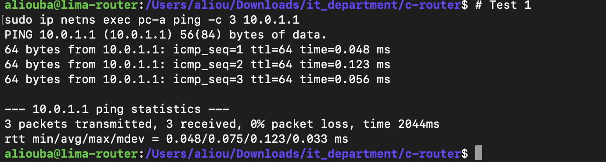
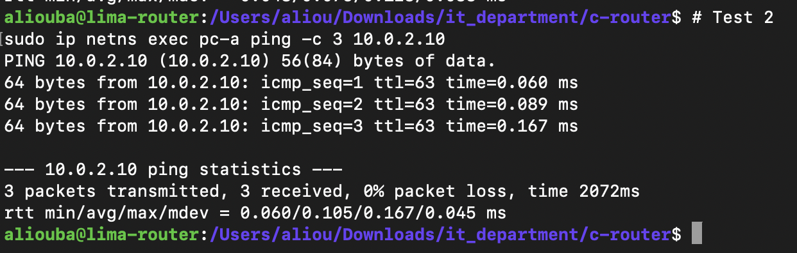
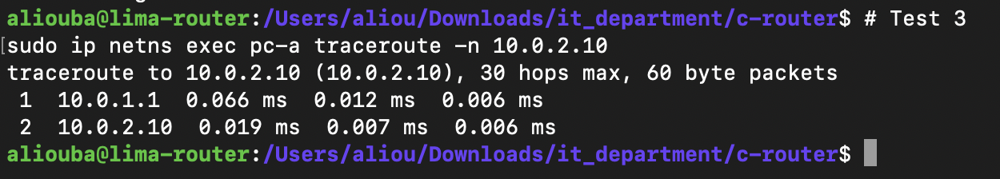
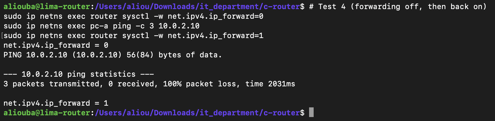
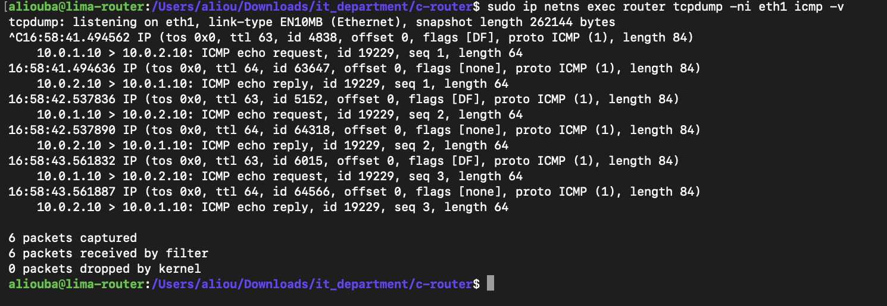

# M1: Network Namespace Lab

## Goal

Build a virtual network laboratory on a single Linux machine to develop and test the C software router. The lab simulates two separate networks connected by a router, using Linux network namespaces and veth pairs.

## Topology

```text
  pc-a                 router                 pc-b
┌────────┐        ┌───────────────┐        ┌────────┐
│  eth0  │────────│ eth0     eth1 │────────│  eth0  │
│10.0.1.10        │10.0.1.1  10.0.2.1       10.0.2.10│
└────────┘        └───────────────┘        └────────┘
     veth pair 1               veth pair 2

   Network A: 10.0.1.0/24       Network B: 10.0.2.0/24
```

| Namespace | Interface | IP address   | Default gateway |
|-----------|-----------|--------------|-----------------|
| pc-a      | eth0      | 10.0.1.10/24 | 10.0.1.1        |
| router    | eth0      | 10.0.1.1/24  | n/a             |
| router    | eth1      | 10.0.2.1/24  | n/a             |
| pc-b      | eth0      | 10.0.2.10/24 | 10.0.2.1        |

## Key concepts

- **Network namespace:** an isolated copy of the Linux network stack, with its own interfaces, IP addresses and routing table. Each namespace behaves like a separate machine.
- **veth pair:** a virtual Ethernet cable. A packet sent into one end comes out of the other end.
- **IP forwarding:** the Linux kernel setting (`net.ipv4.ip_forward`) that allows a machine to route packets between its interfaces.

## Environment

- Host: MacBook (Apple Silicon)
- Linux VM: Ubuntu, managed with Lima
- Tools: iproute2, tcpdump, traceroute, clang, make

## How to run

```bash
make lab-up      # build the lab
make lab-down    # remove the lab
```

The scripts are in `scripts/netns-up.sh` and `scripts/netns-down.sh`.

## Tests

### Test 1: pc-a reaches its gateway

```bash
sudo ip netns exec pc-a ping -c 3 10.0.1.1
```



### Test 2: pc-a reaches pc-b through the router

```bash
sudo ip netns exec pc-a ping -c 3 10.0.2.10
```



### Test 3: path through the router

```bash
sudo ip netns exec pc-a traceroute -n 10.0.2.10
```

Expected: two hops, `10.0.1.1` then `10.0.2.10`.



### Test 4: forwarding disabled

```bash
sudo ip netns exec router sysctl -w net.ipv4.ip_forward=0
sudo ip netns exec pc-a ping -c 3 10.0.2.10
```

Expected: ping fails. This proves the router namespace is responsible for forwarding traffic between the two networks.



### Test 5: packet capture on the router

```bash
sudo ip netns exec router tcpdump -ni eth1 icmp -v
```

Output:

```text
15:17:18.610449 IP (tos 0x0, ttl 63, id 49823, offset 0, flags [DF], proto ICMP (1), length 84)
    10.0.1.10 > 10.0.2.10: ICMP echo request, id 18371, seq 1, length 64
15:17:18.610471 IP (tos 0x0, ttl 64, id 62391, offset 0, flags [none], proto ICMP (1), length 84)
    10.0.2.10 > 10.0.1.10: ICMP echo reply, id 18371, seq 1, length 64
```



## Analysis

- **The echo request has TTL 63.** pc-a sends it with TTL 64. The router decrements the TTL by 1 before forwarding it out of eth1. This is direct evidence that the packet was routed.
- **The echo reply has TTL 64.** It was captured on eth1 as it enters the router, before any decrement. It becomes 63 after the router forwards it out of eth0.
- **Different IP ID and flags.** The request and the reply are two independent packets built by two different hosts, so each has its own IP ID and flags.
- **Latency is around 0.02 ms.** All traffic stays in memory inside one machine.

## What changes in later milestones

In M1, the Linux kernel performs the routing. Starting at M5, IP forwarding will be disabled in the router namespace (`net.ipv4.ip_forward=0`), and the C program will take over: receiving packets, decrementing the TTL, recalculating the IPv4 header checksum and forwarding them.

## Status

M1 complete.
