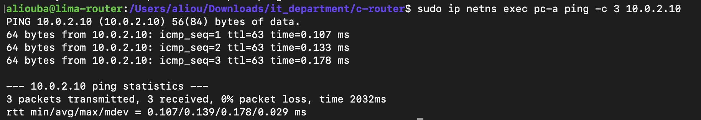
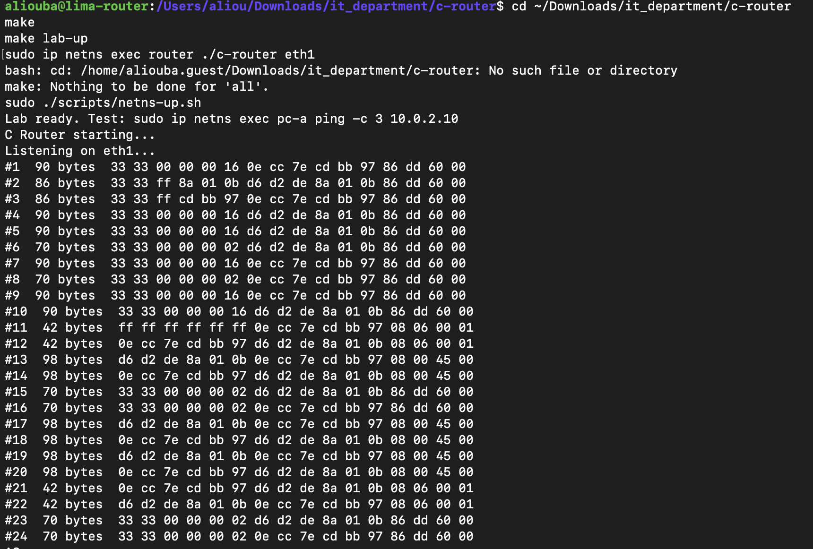
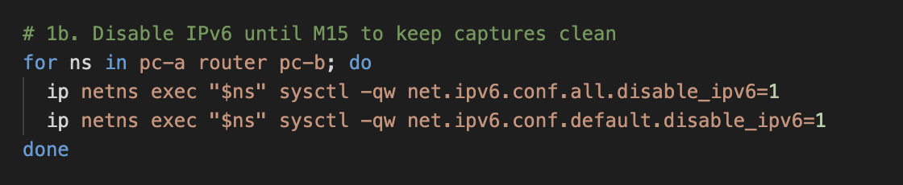

# M2: Packet Capture

## Goal

Write a C program that receives raw Ethernet frames from a network interface of the router namespace and displays them. This is the first building block of the router: every later feature (parsing, routing, firewall, NAT) starts with receiving a packet.

At this stage the program is a pure observer. The Linux kernel still forwards packets (`net.ipv4.ip_forward=1`). The program receives a copy of each frame, like tcpdump.

## Key concepts

- **Kernel space / user space:** a normal program cannot access the network card directly. It asks the Linux kernel through system calls.
- **Socket:** a communication channel managed by the kernel.
- **Raw socket (`AF_PACKET`, `SOCK_RAW`):** delivers complete Ethernet frames, headers included, for all traffic on the interface. It requires root privileges because it can see every packet.
- **File descriptor:** the small integer returned by `socket()` that identifies the socket in all later calls.
- **Interface index:** the kernel identifies interfaces by number, not by name. `if_nametoindex("eth1")` converts the name to its number.
- **bind:** attaches the socket to a single interface, so it only receives frames from that interface.
- **recv (blocking):** waits until a frame arrives, then copies it into a buffer and returns its size.
- **Buffer:** a 2048-byte array that receives each frame. The largest standard Ethernet frame is 1514 bytes.
- **Byte order:** network protocols use big-endian order. `htons()` converts values from host order to network order.

No external library is used, only the C standard library and Linux system headers. libpcap was deliberately avoided in order to work directly with the kernel interface, and because the same raw socket will later be used to transmit packets (M5).

## How to run

```bash
make
make lab-up
sudo ip netns exec router ./c-router eth1
```

In a second terminal, generate traffic:

```bash
sudo ip netns exec pc-a ping -c 3 10.0.2.10
```



```text
PING 10.0.2.10 (10.0.2.10) 56(84) bytes of data.
64 bytes from 10.0.2.10: icmp_seq=1 ttl=63 time=0.107 ms
64 bytes from 10.0.2.10: icmp_seq=2 ttl=63 time=0.133 ms
64 bytes from 10.0.2.10: icmp_seq=3 ttl=63 time=0.178 ms

--- 10.0.2.10 ping statistics ---
3 packets transmitted, 3 received, 0% packet loss, time 2032ms
```

## Error cases tested

| Command | Result | Reason |
|---|---|---|
| `./c-router` | Usage message | No interface given |
| `./c-router eth1` | `socket: Operation not permitted` | Raw sockets require root |
| `sudo ip netns exec router ./c-router eth9` | `if_nametoindex: No such device` | Interface does not exist |

---

## Step 1: Raw capture

### Algorithm

```text
0. Check that an interface name was given
1. Open a raw socket for all protocols         (socket)
2. Convert the interface name to its index     (if_nametoindex)
3. Attach the socket to that interface         (bind)
4. Loop forever:
     wait for a frame and copy it into the buffer   (recv)
     display its size and its first 16 bytes
5. Close the socket                            (close)
```

Every system call is checked for errors, and the reason is displayed with `perror`.

### Capture 1: with IPv6 enabled

The program was started right after `make lab-up`, then 3 pings were sent from pc-a to pc-b.



```text
#1  90 bytes  33 33 00 00 00 16 0e cc 7e cd bb 97 86 dd 60 00
#2  86 bytes  33 33 ff 8a 01 0b d6 d2 de 8a 01 0b 86 dd 60 00
#3  86 bytes  33 33 ff cd bb 97 0e cc 7e cd bb 97 86 dd 60 00
#4  90 bytes  33 33 00 00 00 16 d6 d2 de 8a 01 0b 86 dd 60 00
#5  90 bytes  33 33 00 00 00 16 d6 d2 de 8a 01 0b 86 dd 60 00
#6  70 bytes  33 33 00 00 00 02 d6 d2 de 8a 01 0b 86 dd 60 00
#7  90 bytes  33 33 00 00 00 16 0e cc 7e cd bb 97 86 dd 60 00
#8  70 bytes  33 33 00 00 00 02 0e cc 7e cd bb 97 86 dd 60 00
#9  90 bytes  33 33 00 00 00 16 0e cc 7e cd bb 97 86 dd 60 00
#10  90 bytes  33 33 00 00 00 16 d6 d2 de 8a 01 0b 86 dd 60 00
#11  42 bytes  ff ff ff ff ff ff 0e cc 7e cd bb 97 08 06 00 01
#12  42 bytes  0e cc 7e cd bb 97 d6 d2 de 8a 01 0b 08 06 00 01
#13  98 bytes  d6 d2 de 8a 01 0b 0e cc 7e cd bb 97 08 00 45 00
#14  98 bytes  0e cc 7e cd bb 97 d6 d2 de 8a 01 0b 08 00 45 00
#15  70 bytes  33 33 00 00 00 02 d6 d2 de 8a 01 0b 86 dd 60 00
#16  70 bytes  33 33 00 00 00 02 0e cc 7e cd bb 97 86 dd 60 00
#17  98 bytes  d6 d2 de 8a 01 0b 0e cc 7e cd bb 97 08 00 45 00
#18  98 bytes  0e cc 7e cd bb 97 d6 d2 de 8a 01 0b 08 00 45 00
#19  98 bytes  d6 d2 de 8a 01 0b 0e cc 7e cd bb 97 08 00 45 00
#20  98 bytes  0e cc 7e cd bb 97 d6 d2 de 8a 01 0b 08 00 45 00
#21  42 bytes  0e cc 7e cd bb 97 d6 d2 de 8a 01 0b 08 06 00 01
#22  42 bytes  d6 d2 de 8a 01 0b 0e cc 7e cd bb 97 08 06 00 01
#23  70 bytes  33 33 00 00 00 02 d6 d2 de 8a 01 0b 86 dd 60 00
#24  70 bytes  33 33 00 00 00 02 0e cc 7e cd bb 97 86 dd 60 00
```

Frames #1 to #10 arrived before any ping. Bytes 12-13 (`86 dd`) show they are IPv6. Linux enables IPv6 automatically on every interface, and each interface announces itself when it comes up:

- Destination `33:33:...` is an IPv6 multicast MAC address.
- 86-byte frames to `33:33:ff:...`: Duplicate Address Detection ("is anyone already using my IPv6 address?").
- 90-byte frames to `33:33:00:00:00:16`: multicast group membership reports.
- 70-byte frames to `33:33:00:00:00:02`: Router Solicitations ("is there an IPv6 router here?"), repeated because nobody answers.

The ping itself is visible in frames #11 to #22: ARP (`08 06`) followed by IPv4 (`08 00`).

### Disabling IPv6 in the lab

To keep captures focused on IPv4 until M15, IPv6 is disabled in each namespace by the lab script (`scripts/netns-up.sh`), before the interfaces are created:



```bash
# 1b. Disable IPv6 until M15 to keep captures clean
for ns in pc-a router pc-b; do
  ip netns exec "$ns" sysctl -qw net.ipv6.conf.all.disable_ipv6=1
  ip netns exec "$ns" sysctl -qw net.ipv6.conf.default.disable_ipv6=1
done
```

### Capture 2: IPv6 disabled, 3 pings from pc-a to pc-b


```text
#1  42 bytes  ff ff ff ff ff ff 0a a0 3b 81 74 77 08 06 00 01
#2  42 bytes  0a a0 3b 81 74 77 02 58 29 f9 1a 9c 08 06 00 01
#3  98 bytes  02 58 29 f9 1a 9c 0a a0 3b 81 74 77 08 00 45 00
#4  98 bytes  0a a0 3b 81 74 77 02 58 29 f9 1a 9c 08 00 45 00
#5  98 bytes  02 58 29 f9 1a 9c 0a a0 3b 81 74 77 08 00 45 00
#6  98 bytes  0a a0 3b 81 74 77 02 58 29 f9 1a 9c 08 00 45 00
#7  98 bytes  02 58 29 f9 1a 9c 0a a0 3b 81 74 77 08 00 45 00
#8  98 bytes  0a a0 3b 81 74 77 02 58 29 f9 1a 9c 08 00 45 00
#9  42 bytes  0a a0 3b 81 74 77 02 58 29 f9 1a 9c 08 06 00 01
#10  42 bytes  02 58 29 f9 1a 9c 0a a0 3b 81 74 77 08 06 00 01
```

**Identifying the machines.** Frame #3 is the ping leaving the router toward pc-b, so `0a:a0:3b:81:74:77` is router eth1 and `02:58:29:f9:1a:9c` is pc-b.

Each line shows: destination MAC (bytes 0-5), source MAC (bytes 6-11), type (bytes 12-13), then the start of the payload.

| Frames | Type | Meaning |
|---|---|---|
| #1 | `08 06` ARP | The router broadcasts to `ff:ff:ff:ff:ff:ff`: "Who has 10.0.2.10?" |
| #2 | `08 06` ARP | pc-b answers the router directly with its MAC address |
| #3, #5, #7 | `08 00` IPv4 | ICMP echo request, router to pc-b |
| #4, #6, #8 | `08 00` IPv4 | ICMP echo reply, pc-b to router |
| #9 | `08 06` ARP | pc-b checks that the router's MAC is still valid (unicast) |
| #10 | `08 06` ARP | The router confirms |

### Observations

- **ARP comes first.** The router cannot send the ping until it knows pc-b's MAC address. This is the mechanism that will be implemented in M7.
- **Frame sizes match the protocol layers.** IPv4 frames: 14 (Ethernet) + 20 (IPv4) + 64 (ICMP) = 98 bytes. ARP frames: always 42 bytes.
- **`45` at byte 14** is the first byte of the IPv4 header: version 4, header length 5 x 4 = 20 bytes.
- **MAC addresses change between runs.** Linux assigns a random MAC address to each veth interface when it is created. The router code must never assume fixed MAC addresses.

---

## Step 2: Decoding the Ethernet header

### Goal

Replace the raw byte dump with a readable line: source MAC, destination MAC and the protocol carried by the frame.

### Ethernet header layout

The Ethernet header is always the first 14 bytes of the frame:

```text
byte:   0  1  2  3  4  5 | 6  7  8  9 10 11 | 12 13
        destination MAC  | source MAC       | EtherType
```

### Logic

- **MAC addresses:** bytes 0-5 (destination) and 6-11 (source) are printed as six 2-digit hex values separated by `:`. The source is printed first so the output reads as `sender -> receiver`.
- **EtherType:** bytes 12-13 form one 16-bit number in network byte order: `type = byte12 x 256 + byte13`.

| EtherType | Protocol |
|-----------|----------|
| `0x0800`  | IPv4     |
| `0x0806`  | ARP      |
| `0x86DD`  | IPv6     |

- **Length check:** a frame shorter than 14 bytes is reported and skipped. Without this check, the program would read bytes left over from the previous frame in the buffer (an out-of-bounds read).
- **Pointers instead of copies:** the MAC addresses are not copied. The program points to their position in the buffer (`frame` and `frame + 6`).

### Result: 3 pings from pc-a to pc-b


```text
Listening on eth1...
#1  42 bytes  9e:ef:d1:02:3b:b1 -> ff:ff:ff:ff:ff:ff  ARP (0x0806)
#2  42 bytes  4e:0c:35:4e:f5:37 -> 9e:ef:d1:02:3b:b1  ARP (0x0806)
#3  98 bytes  9e:ef:d1:02:3b:b1 -> 4e:0c:35:4e:f5:37  IPv4 (0x0800)
#4  98 bytes  4e:0c:35:4e:f5:37 -> 9e:ef:d1:02:3b:b1  IPv4 (0x0800)
#5  98 bytes  9e:ef:d1:02:3b:b1 -> 4e:0c:35:4e:f5:37  IPv4 (0x0800)
#6  98 bytes  4e:0c:35:4e:f5:37 -> 9e:ef:d1:02:3b:b1  IPv4 (0x0800)
#7  98 bytes  9e:ef:d1:02:3b:b1 -> 4e:0c:35:4e:f5:37  IPv4 (0x0800)
#8  98 bytes  4e:0c:35:4e:f5:37 -> 9e:ef:d1:02:3b:b1  IPv4 (0x0800)
#9  42 bytes  4e:0c:35:4e:f5:37 -> 9e:ef:d1:02:3b:b1  ARP (0x0806)
#10  42 bytes  9e:ef:d1:02:3b:b1 -> 4e:0c:35:4e:f5:37  ARP (0x0806)
```

In this run, `9e:ef:d1:02:3b:b1` is router eth1 (it sends the ARP broadcast) and `4e:0c:35:4e:f5:37` is pc-b. The MAC addresses differ from Step 1 because the lab was rebuilt, but the pattern is identical: ARP request and reply, three echo request/reply pairs, then an ARP check.

---

## Step 3: Counters and statistics on exit

### Goal

Count frames by type while capturing, and print a summary when the program is stopped with Ctrl+C. This is the first form of observability in the router, similar to the interface counters shown by `show interfaces` on a hardware router.

### Counters

| Counter     | Incremented when                        |
|-------------|-----------------------------------------|
| `total`     | any frame is received                   |
| `ipv4`      | EtherType is `0x0800`                   |
| `arp`       | EtherType is `0x0806`                   |
| `ipv6`      | EtherType is `0x86DD`                   |
| `other`     | any other EtherType                     |
| `too_short` | the frame is shorter than 14 bytes      |
| `bytes`     | always, by the size of the frame        |

### Handling Ctrl+C

Pressing Ctrl+C makes the kernel send the `SIGINT` signal. By default, `SIGINT` terminates the program immediately, so the statistics would never be printed.

The program installs a **signal handler** with `sigaction()`. Because a signal can arrive at any moment (for example in the middle of a `printf`), the handler does only one thing: it sets a flag.

```c
static volatile sig_atomic_t stop_requested = 0;

static void on_sigint(int signum)
{
    (void)signum;
    stop_requested = 1;
}
```

- `volatile` forces the program to read the real current value of the flag, since it can change outside the normal flow.
- `sig_atomic_t` is a type that can be written safely from a signal handler.
- The statistics are printed by the main program, at a safe point, never inside the handler.

### Interaction with `recv()`

The program spends most of its time blocked in `recv()`. The handler is installed **without** the `SA_RESTART` flag, so when `SIGINT` arrives:

1. The handler sets `stop_requested = 1`.
2. `recv()` is interrupted and returns `-1` with `errno == EINTR`.
3. The loop treats `EINTR` as a normal wake-up, not an error, and checks the flag.
4. The loop ends, the statistics are printed and the socket is closed.

```text
recv() blocked ──Ctrl+C──► handler: stop_requested = 1
                           recv() returns -1, errno = EINTR
                           loop checks the flag and exits
                           print statistics
                           close the socket
```

### Algorithm

```text
install handler: on SIGINT, set stop_requested = 1

WHILE stop_requested = 0:
    size <- receive a frame
    IF size = -1:
        IF error is EINTR: continue (the flag will be checked)
        ELSE: report the error, exit the loop
    total <- total + 1, bytes <- bytes + size
    IF size < 14: too_short <- too_short + 1, skip
    read the EtherType and increment the matching counter
    display the frame

print the statistics
close the socket
```

### Result: 3 pings from pc-a to pc-b, then Ctrl+C


```text
Listening on eth1... (Ctrl+C to stop)
#1  42 bytes  72:3c:21:46:36:31 -> ff:ff:ff:ff:ff:ff  ARP (0x0806)
#2  42 bytes  aa:84:c4:ab:13:0e -> 72:3c:21:46:36:31  ARP (0x0806)
#3  98 bytes  72:3c:21:46:36:31 -> aa:84:c4:ab:13:0e  IPv4 (0x0800)
#4  98 bytes  aa:84:c4:ab:13:0e -> 72:3c:21:46:36:31  IPv4 (0x0800)
#5  98 bytes  72:3c:21:46:36:31 -> aa:84:c4:ab:13:0e  IPv4 (0x0800)
#6  98 bytes  aa:84:c4:ab:13:0e -> 72:3c:21:46:36:31  IPv4 (0x0800)
#7  98 bytes  72:3c:21:46:36:31 -> aa:84:c4:ab:13:0e  IPv4 (0x0800)
#8  98 bytes  aa:84:c4:ab:13:0e -> 72:3c:21:46:36:31  IPv4 (0x0800)
#9  42 bytes  aa:84:c4:ab:13:0e -> 72:3c:21:46:36:31  ARP (0x0806)
#10  42 bytes  72:3c:21:46:36:31 -> aa:84:c4:ab:13:0e  ARP (0x0806)
^C
--- Capture statistics (eth1) ---
Total frames : 10
  IPv4       : 6
  ARP        : 4
  IPv6       : 0
  Other      : 0
  Too short  : 0
Total bytes  : 756
```

Ctrl+C did not kill the program: the handler set the flag, `recv()` returned with `EINTR`, the loop ended and the statistics were printed before the socket was closed.

The byte counter can be checked by hand:

```text
6 IPv4 frames x 98 bytes = 588
4 ARP frames  x 42 bytes = 168
                   Total = 756 bytes
```

---

## M2 summary

| Step | Result |
|------|--------|
| 1 | Raw `AF_PACKET` socket bound to one interface, receiving every Ethernet frame |
| 2 | Ethernet header decoded: source MAC, destination MAC, EtherType, with a length check |
| 3 | Per-protocol counters and a clean shutdown on Ctrl+C using a signal handler |

### What was learned

- How a user-space program receives packets through the kernel (system calls, sockets, file descriptors).
- Why raw sockets require root privileges.
- How to read a fixed binary header safely: check the length first, then read fields at known offsets.
- Network byte order (big-endian) and how to rebuild a 16-bit field from two bytes.
- How signals work, why a signal handler must stay minimal, and how `EINTR` interrupts blocking calls.

### Limitations (addressed in later milestones)

- Only one interface is captured at a time. The router will need to listen on eth0 and eth1 together.
- The program only observes. Linux still forwards the packets (M5 will change this).
- Only the Ethernet header is decoded. The IPv4 header is parsed in M3.

## Status

- [x] Step 1: raw socket capture on one interface
- [x] Step 2: decode the Ethernet header (MAC addresses and type)
- [x] Step 3: packet counters and statistics on exit

**M2 complete.**
