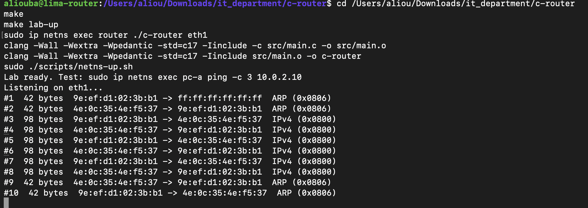
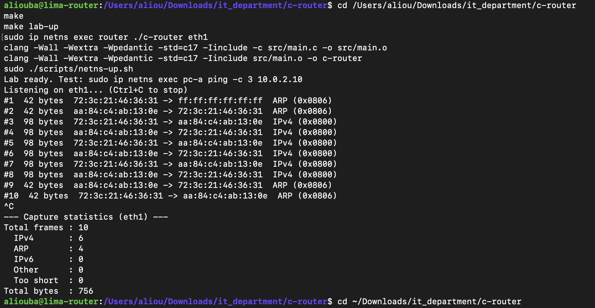

# M2: Packet Capture

## Goal

Write a C program that receives raw Ethernet frames from a network interface of the router namespace and displays them. This is the first building block of the router: every later feature (parsing, routing, firewall, NAT) starts with receiving a packet.

At this stage the program is a pure observer. The Linux kernel still forwards packets (`net.ipv4.ip_forward=1`). The program receives a copy of each frame, like tcpdump.

## Key concepts

- **Kernel space / user space:** a normal program cannot access the network card directly. It asks the Linux kernel through system calls.
- **Socket:** a communication channel managed by the kernel.
- **Raw socket (`AF_PACKET`, `SOCK_RAW`):** delivers complete Ethernet frames, headers included, for all traffic on the interface. It requires root privileges because it can see every packet.
- **File descriptor:** the small integer returned by `socket()` that identifies the socket in all later calls.
- **Interface index:** the kernel identifies interfaces by number, not by name. `if_nametoindex("eth1")` converts the name to its number.
- **bind:** attaches the socket to a single interface, so it only receives frames from that interface.
- **recv (blocking):** waits until a frame arrives, then copies it into a buffer and returns its size.
- **Buffer:** a 2048-byte array that receives each frame. The largest standard Ethernet frame is 1514 bytes.
- **Byte order:** network protocols use big-endian order. `htons()` converts values from host order to network order.

No external library is used, only the C standard library and Linux system headers. libpcap was deliberately avoided in order to work directly with the kernel interface, and because the same raw socket will later be used to transmit packets (M5).

## Algorithm

```text
0. Check that an interface name was given
1. Open a raw socket for all protocols         (socket)
2. Convert the interface name to its index     (if_nametoindex)
3. Attach the socket to that interface         (bind)
4. Loop forever:
     wait for a frame and copy it into the buffer   (recv)
     display its size and its first 16 bytes
5. Close the socket                            (close)
```

Every system call is checked for errors, and the reason is displayed with `perror`.

## How to run

```bash
make
make lab-up
sudo ip netns exec router ./c-router eth1
```

In a second terminal:

```bash
sudo ip netns exec pc-a ping -c 3 10.0.2.10
```

## Error cases tested

| Command | Result | Reason |
|---|---|---|
| `./c-router` | Usage message | No interface given |
| `./c-router eth1` | `socket: Operation not permitted` | Raw sockets require root |
| `sudo ip netns exec router ./c-router eth9` | `if_nametoindex: No such device` | Interface does not exist |

## Capture 1: with IPv6 enabled

The program was started right after `make lab-up`, before any ping:


Frames were captured even without a ping. Bytes 12-13 (`86 dd`) show they are IPv6. Linux enables IPv6 automatically on every interface, and each interface announces itself when it comes up:

- Destination `33:33:...` is an IPv6 multicast MAC address.
- 86-byte frames to `33:33:ff:...`: Duplicate Address Detection ("is anyone already using my IPv6 address?").
- 90-byte frames to `33:33:00:00:00:16`: multicast group membership reports.
- 70-byte frames to `33:33:00:00:00:02`: Router Solicitations ("is there an IPv6 router here?"), repeated because nobody answers.

To keep captures focused on IPv4 until M15, IPv6 is now disabled in the lab script (`net.ipv6.conf.all.disable_ipv6=1` in each namespace).


## Capture 2: IPv6 disabled, 3 pings from pc-a to pc-b

```text
#1  42 bytes  ff ff ff ff ff ff 0a a0 3b 81 74 77 08 06 00 01
#2  42 bytes  0a a0 3b 81 74 77 02 58 29 f9 1a 9c 08 06 00 01
#3  98 bytes  02 58 29 f9 1a 9c 0a a0 3b 81 74 77 08 00 45 00
#4  98 bytes  0a a0 3b 81 74 77 02 58 29 f9 1a 9c 08 00 45 00
#5  98 bytes  02 58 29 f9 1a 9c 0a a0 3b 81 74 77 08 00 45 00
#6  98 bytes  0a a0 3b 81 74 77 02 58 29 f9 1a 9c 08 00 45 00
#7  98 bytes  02 58 29 f9 1a 9c 0a a0 3b 81 74 77 08 00 45 00
#8  98 bytes  0a a0 3b 81 74 77 02 58 29 f9 1a 9c 08 00 45 00
#9  42 bytes  0a a0 3b 81 74 77 02 58 29 f9 1a 9c 08 06 00 01
#10  42 bytes  02 58 29 f9 1a 9c 0a a0 3b 81 74 77 08 06 00 01
```


### Identifying the machines

Frame #3 is the ping leaving the router toward pc-b, so:

- `0a:a0:3b:81:74:77` = router eth1
- `02:58:29:f9:1a:9c` = pc-b

### Reading the frames

Each line shows: destination MAC (bytes 0-5), source MAC (bytes 6-11), type (bytes 12-13), then the start of the payload.

| Frames | Type | Meaning |
|---|---|---|
| #1 | `08 06` ARP | The router broadcasts to `ff:ff:ff:ff:ff:ff`: "Who has 10.0.2.10?" |
| #2 | `08 06` ARP | pc-b answers the router directly with its MAC address |
| #3, #5, #7 | `08 00` IPv4 | ICMP echo request, router to pc-b |
| #4, #6, #8 | `08 00` IPv4 | ICMP echo reply, pc-b to router |
| #9 | `08 06` ARP | pc-b checks that the router's MAC is still valid (unicast) |
| #10 | `08 06` ARP | The router confirms |

### Observations

- **ARP comes first.** The router cannot send the ping until it knows pc-b's MAC address. This is the mechanism that will be implemented in M7.
- **Frame sizes match the protocol layers.** IPv4 frames: 14 (Ethernet) + 20 (IPv4) + 64 (ICMP) = 98 bytes. ARP frames: always 42 bytes.
- **`45` at byte 14** is the first byte of the IPv4 header: version 4, header length 5 x 4 = 20 bytes.
- **MAC addresses change between runs.** Linux assigns a random MAC address to each veth interface when it is created. The router code must never assume fixed MAC addresses.

## Step 3: Counters and statistics on exit

### Goal

Count frames by type while capturing, and print a summary when the program is stopped with Ctrl+C. This is the first form of observability in the router, similar to the interface counters shown by `show interfaces` on a hardware router.

### Counters

All counters are grouped in one structure:

| Counter     | Incremented when                        |
|-------------|-----------------------------------------|
| `total`     | any frame is received                   |
| `ipv4`      | EtherType is `0x0800`                   |
| `arp`       | EtherType is `0x0806`                   |
| `ipv6`      | EtherType is `0x86DD`                   |
| `other`     | any other EtherType                     |
| `too_short` | the frame is shorter than 14 bytes      |
| `bytes`     | always, by the size of the frame        |

### Handling Ctrl+C

Pressing Ctrl+C makes the kernel send the `SIGINT` signal. By default, `SIGINT` terminates the program immediately, so the statistics would never be printed.

The program installs a **signal handler** with `sigaction()`. Because a signal can arrive at any moment (for example in the middle of a `printf`), the handler does only one thing: it sets a flag.

```c
static volatile sig_atomic_t stop_requested = 0;

static void on_sigint(int signum)
{
    (void)signum;
    stop_requested = 1;
}
```

- `volatile` forces the program to read the real current value of the flag, since it can change outside the normal flow.
- `sig_atomic_t` is a type that can be written safely from a signal handler.
- The statistics are printed by the main program, at a safe point, never inside the handler.

### Interaction with `recv()`

The program spends most of its time blocked in `recv()`. The handler is installed **without** the `SA_RESTART` flag, so when `SIGINT` arrives:

1. The handler sets `stop_requested = 1`.
2. `recv()` is interrupted and returns `-1` with `errno == EINTR`.
3. The loop treats `EINTR` as a normal wake-up, not an error, and checks the flag.
4. The loop ends, the statistics are printed and the socket is closed.

Any other error from `recv()` is reported with `perror` and stops the loop.

```text
recv() blocked ──Ctrl+C──► handler: stop_requested = 1
                           recv() returns -1, errno = EINTR
                           loop checks the flag and exits
                           print statistics
                           close the socket
```

### Algorithm

```text
install handler: on SIGINT, set stop_requested = 1

WHILE stop_requested = 0:
    size <- receive a frame
    IF size = -1:
        IF error is EINTR: continue (the flag will be checked)
        ELSE: report the error, exit the loop
    total <- total + 1, bytes <- bytes + size
    IF size < 14: too_short <- too_short + 1, skip
    read the EtherType and increment the matching counter
    display the frame

print the statistics
close the socket
```

### Result: 3 pings from pc-a to pc-b, then Ctrl+C




### Verification

The byte counter can be checked by hand:

```text
6 IPv4 frames x 98 bytes = 588
4 ARP frames  x 42 bytes = 168
                   Total = 756 bytes
```

## M2 summary

| Step | Result |
|------|--------|
| 1 | Raw `AF_PACKET` socket bound to one interface, receiving every Ethernet frame |
| 2 | Ethernet header decoded: source MAC, destination MAC, EtherType, with a length check |
| 3 | Per-protocol counters and a clean shutdown on Ctrl+C using a signal handler |

### What was learned

- How a user-space program receives packets through the kernel (system calls, sockets, file descriptors).
- Why raw sockets require root privileges.
- How to read a fixed binary header safely: check the length first, then read fields at known offsets.
- Network byte order (big-endian) and how to rebuild a 16-bit field from two bytes.
- How signals work, why a signal handler must stay minimal, and how `EINTR` interrupts blocking calls.

### Limitations (addressed in later milestones)

- Only one interface is captured at a time. The router will need to listen on eth0 and eth1 together.
- The program only observes. Linux still forwards the packets (M5 will change this).
- Only the Ethernet header is decoded. The IPv4 header is parsed in M3.

## Status

- [x] Step 1: raw socket capture on one interface
- [x] Step 2: decode the Ethernet header (MAC addresses and type)
- [x] Step 3: packet counters and statistics on exit

**M2 complete.**
