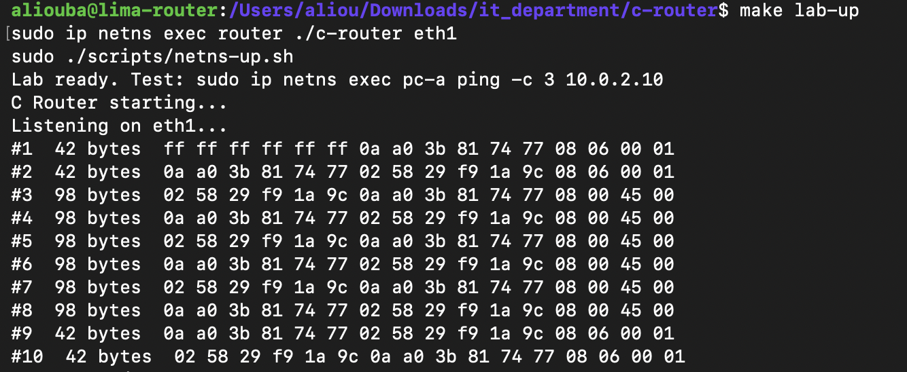

# M2: Packet Capture

## Goal

Write a C program that receives raw Ethernet frames from a network interface of the router namespace and displays them. This is the first building block of the router: every later feature (parsing, routing, firewall, NAT) starts with receiving a packet.

At this stage the program is a pure observer. The Linux kernel still forwards packets (`net.ipv4.ip_forward=1`). The program receives a copy of each frame, like tcpdump.

## Key concepts

- **Kernel space / user space:** a normal program cannot access the network card directly. It asks the Linux kernel through system calls.
- **Socket:** a communication channel managed by the kernel.
- **Raw socket (`AF_PACKET`, `SOCK_RAW`):** delivers complete Ethernet frames, headers included, for all traffic on the interface. It requires root privileges because it can see every packet.
- **File descriptor:** the small integer returned by `socket()` that identifies the socket in all later calls.
- **Interface index:** the kernel identifies interfaces by number, not by name. `if_nametoindex("eth1")` converts the name to its number.
- **bind:** attaches the socket to a single interface, so it only receives frames from that interface.
- **recv (blocking):** waits until a frame arrives, then copies it into a buffer and returns its size.
- **Buffer:** a 2048-byte array that receives each frame. The largest standard Ethernet frame is 1514 bytes.
- **Byte order:** network protocols use big-endian order. `htons()` converts values from host order to network order.

No external library is used, only the C standard library and Linux system headers. libpcap was deliberately avoided in order to work directly with the kernel interface, and because the same raw socket will later be used to transmit packets (M5).

## Algorithm

```text
0. Check that an interface name was given
1. Open a raw socket for all protocols         (socket)
2. Convert the interface name to its index     (if_nametoindex)
3. Attach the socket to that interface         (bind)
4. Loop forever:
     wait for a frame and copy it into the buffer   (recv)
     display its size and its first 16 bytes
5. Close the socket                            (close)
```

Every system call is checked for errors, and the reason is displayed with `perror`.

## How to run

```bash
make
make lab-up
sudo ip netns exec router ./c-router eth1
```

In a second terminal:

```bash
sudo ip netns exec pc-a ping -c 3 10.0.2.10
```

## Error cases tested

| Command | Result | Reason |
|---|---|---|
| `./c-router` | Usage message | No interface given |
| `./c-router eth1` | `socket: Operation not permitted` | Raw sockets require root |
| `sudo ip netns exec router ./c-router eth9` | `if_nametoindex: No such device` | Interface does not exist |

## Capture 1: with IPv6 enabled

The program was started right after `make lab-up`, before any ping:

```text
#1  90 bytes  33 33 00 00 00 16 0e cc 7e cd bb 97 86 dd 60 00
#2  86 bytes  33 33 ff 8a 01 0b d6 d2 de 8a 01 0b 86 dd 60 00
#3  86 bytes  33 33 ff cd bb 97 0e cc 7e cd bb 97 86 dd 60 00
#4  90 bytes  33 33 00 00 00 16 d6 d2 de 8a 01 0b 86 dd 60 00
#5  90 bytes  33 33 00 00 00 16 d6 d2 de 8a 01 0b 86 dd 60 00
#6  70 bytes  33 33 00 00 00 02 d6 d2 de 8a 01 0b 86 dd 60 00
#7  90 bytes  33 33 00 00 00 16 0e cc 7e cd bb 97 86 dd 60 00
#8  70 bytes  33 33 00 00 00 02 0e cc 7e cd bb 97 86 dd 60 00
#9  90 bytes  33 33 00 00 00 16 0e cc 7e cd bb 97 86 dd 60 00
#10  90 bytes  33 33 00 00 00 16 d6 d2 de 8a 01 0b 86 dd 60 00
#11  42 bytes  ff ff ff ff ff ff 0e cc 7e cd bb 97 08 06 00 01
#12  42 bytes  0e cc 7e cd bb 97 d6 d2 de 8a 01 0b 08 06 00 01
#13  98 bytes  d6 d2 de 8a 01 0b 0e cc 7e cd bb 97 08 00 45 00
#14  98 bytes  0e cc 7e cd bb 97 d6 d2 de 8a 01 0b 08 00 45 00
```

Frames were captured even without a ping. Bytes 12-13 (`86 dd`) show they are IPv6. Linux enables IPv6 automatically on every interface, and each interface announces itself when it comes up:

- Destination `33:33:...` is an IPv6 multicast MAC address.
- 86-byte frames to `33:33:ff:...`: Duplicate Address Detection ("is anyone already using my IPv6 address?").
- 90-byte frames to `33:33:00:00:00:16`: multicast group membership reports.
- 70-byte frames to `33:33:00:00:00:02`: Router Solicitations ("is there an IPv6 router here?"), repeated because nobody answers.

To keep captures focused on IPv4 until M15, IPv6 is now disabled in the lab script (`net.ipv6.conf.all.disable_ipv6=1` in each namespace).

## Capture 2: IPv6 disabled, 3 pings from pc-a to pc-b

```text
#1  42 bytes  ff ff ff ff ff ff 0a a0 3b 81 74 77 08 06 00 01
#2  42 bytes  0a a0 3b 81 74 77 02 58 29 f9 1a 9c 08 06 00 01
#3  98 bytes  02 58 29 f9 1a 9c 0a a0 3b 81 74 77 08 00 45 00
#4  98 bytes  0a a0 3b 81 74 77 02 58 29 f9 1a 9c 08 00 45 00
#5  98 bytes  02 58 29 f9 1a 9c 0a a0 3b 81 74 77 08 00 45 00
#6  98 bytes  0a a0 3b 81 74 77 02 58 29 f9 1a 9c 08 00 45 00
#7  98 bytes  02 58 29 f9 1a 9c 0a a0 3b 81 74 77 08 00 45 00
#8  98 bytes  0a a0 3b 81 74 77 02 58 29 f9 1a 9c 08 00 45 00
#9  42 bytes  0a a0 3b 81 74 77 02 58 29 f9 1a 9c 08 06 00 01
#10  42 bytes  02 58 29 f9 1a 9c 0a a0 3b 81 74 77 08 06 00 01
```



### Identifying the machines

Frame #3 is the ping leaving the router toward pc-b, so:

- `0a:a0:3b:81:74:77` = router eth1
- `02:58:29:f9:1a:9c` = pc-b

### Reading the frames

Each line shows: destination MAC (bytes 0-5), source MAC (bytes 6-11), type (bytes 12-13), then the start of the payload.

| Frames | Type | Meaning |
|---|---|---|
| #1 | `08 06` ARP | The router broadcasts to `ff:ff:ff:ff:ff:ff`: "Who has 10.0.2.10?" |
| #2 | `08 06` ARP | pc-b answers the router directly with its MAC address |
| #3, #5, #7 | `08 00` IPv4 | ICMP echo request, router to pc-b |
| #4, #6, #8 | `08 00` IPv4 | ICMP echo reply, pc-b to router |
| #9 | `08 06` ARP | pc-b checks that the router's MAC is still valid (unicast) |
| #10 | `08 06` ARP | The router confirms |

### Observations

- **ARP comes first.** The router cannot send the ping until it knows pc-b's MAC address. This is the mechanism that will be implemented in M7.
- **Frame sizes match the protocol layers.** IPv4 frames: 14 (Ethernet) + 20 (IPv4) + 64 (ICMP) = 98 bytes. ARP frames: always 42 bytes.
- **`45` at byte 14** is the first byte of the IPv4 header: version 4, header length 5 x 4 = 20 bytes.
- **MAC addresses change between runs.** Linux assigns a random MAC address to each veth interface when it is created. The router code must never assume fixed MAC addresses.

## Status

- [x] Step 1: raw socket capture on one interface
- [ ] Step 2: decode the Ethernet header (MAC addresses and type)
- [ ] Step 3: packet counters and statistics on exit
