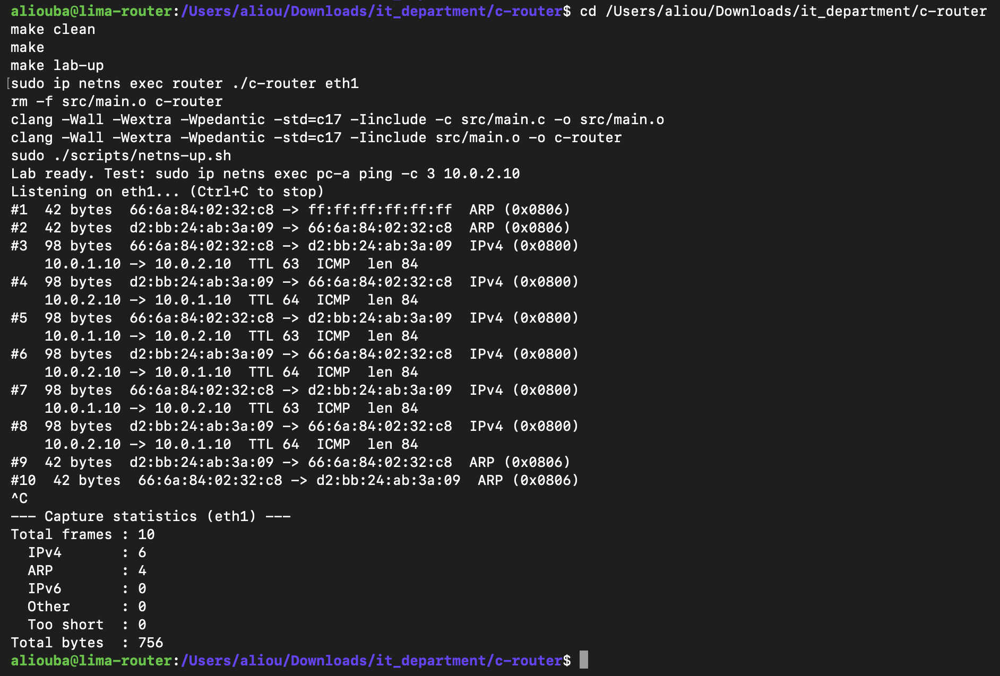

# M3: IPv4 Header Parsing

## Goal

Read the IPv4 header that follows the Ethernet header, validate it, and display the fields a router needs: source and destination addresses, TTL, protocol and total length.

## Where the IPv4 header is

When the EtherType (bytes 12-13) is `0x0800`, the IPv4 header starts at byte 14 of the frame and is 20 bytes long (without options).

| Bytes  | Field                        | Example (ping) | Value                  |
|--------|------------------------------|----------------|------------------------|
| 14     | Version + header length      | `45`           | IPv4, 5 x 4 = 20 bytes |
| 15     | Type of service              | `00`           | ignored                |
| 16-17  | Total length                 | `00 54`        | 84 bytes               |
| 18-19  | Identification               | `c2 9f`        | packet ID              |
| 20-21  | Flags + fragment offset      | `40 00`        | Don't Fragment         |
| 22     | TTL                          | `3f`           | 63                     |
| 23     | Protocol                     | `01`           | ICMP                   |
| 24-25  | Header checksum              |                | used in M5             |
| 26-29  | Source IP                    | `0a 00 01 0a`  | 10.0.1.10              |
| 30-33  | Destination IP               | `0a 00 02 0a`  | 10.0.2.10              |

## Why a router needs these fields

- **Destination IP:** decides where the packet goes (routing, M4).
- **TTL:** must be decremented at each hop. The packet is dropped at 0 so it cannot loop forever (M5).
- **Protocol:** tells what the packet carries (ICMP = 1, TCP = 6, UDP = 17), needed later for the firewall and NAT.
- **Total length:** used to validate the packet.
- **Checksum:** must be recalculated when the TTL changes (M5).

## Reading the fields

A byte holds a number from 0 to 255, usually written as two hex digits (`45` in hex is 69).

- **Byte 14 holds two values.** The first hex digit is the version, the second is the header length in 4-byte words: `version = byte14 / 16`, `header_length = (byte14 % 16) * 4`. For `45`: version 4, header length 5 x 4 = 20 bytes.
- **Two-byte fields** (total length) are combined in network byte order: `byte16 * 256 + byte17`. For `00 54`: 0 x 256 + 84 = 84.
- **IP addresses** are 4 bytes, each printed as a decimal number, separated by dots. `0a 00 01 0a` gives 10.0.1.10.

## Input validation

Every check runs before the fields it protects are read. A packet that fails any check is reported and skipped.

| Check | Protects against |
|---|---|
| Frame length >= 34 bytes | A frame too short to contain an IPv4 header |
| Version == 4 | A packet labelled IPv4 that is not |
| Header length >= 20 | An impossible header length |
| 14 + header length <= frame length | A header that claims to extend past the received data |
| header length <= total length, and 14 + total length <= frame length | A packet lying about its own size (the class of bug behind Heartbleed) |

## Algorithm

```text
IF EtherType is IPv4:
    IF frame < 34 bytes: report, skip
    version       <- byte14 / 16
    header_length <- (byte14 % 16) * 4
    IF version != 4 OR header_length < 20 OR header too long: report, skip
    total_length  <- byte16 * 256 + byte17
    IF total_length is inconsistent: report, skip
    ttl <- byte22, protocol <- byte23
    source <- bytes 26-29, destination <- bytes 30-33
    print: source -> destination, TTL, protocol, length
```

## Code structure

Three functions were added to `src/main.c`:

- `print_ip(ip)`: prints 4 bytes as `a.b.c.d`.
- `protocol_name(protocol)`: returns `"ICMP"`, `"TCP"`, `"UDP"` or `"other"`.
- `print_ipv4(frame, size)`: runs the checks above, then prints the IPv4 line. It is called in the receive loop only when the EtherType is `0x0800`.

## Capture: 3 pings from pc-a to pc-b



```text
Listening on eth1... (Ctrl+C to stop)
#1  42 bytes  66:6a:84:02:32:c8 -> ff:ff:ff:ff:ff:ff  ARP (0x0806)
#2  42 bytes  d2:bb:24:ab:3a:09 -> 66:6a:84:02:32:c8  ARP (0x0806)
#3  98 bytes  66:6a:84:02:32:c8 -> d2:bb:24:ab:3a:09  IPv4 (0x0800)
    10.0.1.10 -> 10.0.2.10  TTL 63  ICMP  len 84
#4  98 bytes  d2:bb:24:ab:3a:09 -> 66:6a:84:02:32:c8  IPv4 (0x0800)
    10.0.2.10 -> 10.0.1.10  TTL 64  ICMP  len 84
#5  98 bytes  66:6a:84:02:32:c8 -> d2:bb:24:ab:3a:09  IPv4 (0x0800)
    10.0.1.10 -> 10.0.2.10  TTL 63  ICMP  len 84
#6  98 bytes  d2:bb:24:ab:3a:09 -> 66:6a:84:02:32:c8  IPv4 (0x0800)
    10.0.2.10 -> 10.0.1.10  TTL 64  ICMP  len 84
#7  98 bytes  66:6a:84:02:32:c8 -> d2:bb:24:ab:3a:09  IPv4 (0x0800)
    10.0.1.10 -> 10.0.2.10  TTL 63  ICMP  len 84
#8  98 bytes  d2:bb:24:ab:3a:09 -> 66:6a:84:02:32:c8  IPv4 (0x0800)
    10.0.2.10 -> 10.0.1.10  TTL 64  ICMP  len 84
#9  42 bytes  d2:bb:24:ab:3a:09 -> 66:6a:84:02:32:c8  ARP (0x0806)
#10  42 bytes  66:6a:84:02:32:c8 -> d2:bb:24:ab:3a:09  ARP (0x0806)
^C
--- Capture statistics (eth1) ---
Total frames : 10
  IPv4       : 6
  ARP        : 4
  IPv6       : 0
  Other      : 0
  Too short  : 0
Total bytes  : 756
```

## Observations

- **TTL 63 on the requests, 64 on the replies.** pc-a sends the echo request with TTL 64 and the router decrements it to 63 before forwarding it out of eth1. The reply is captured as it enters the router from pc-b, before any decrement. This matches the tcpdump capture from M1, now decoded by the program itself.
- **Addresses match the lab.** Requests go from 10.0.1.10 (pc-a) to 10.0.2.10 (pc-b), replies go the other way.
- **Protocol 1 is decoded as ICMP,** as expected for ping.
- **Lengths are consistent.** IPv4 total length 84 + Ethernet header 14 = 98 bytes, the size received by the socket.
- **Only IPv4 frames get a second line.** ARP frames (#1, #2, #9, #10) are not parsed as IPv4.
- **No packet failed validation,** so none of the error lines appeared.

## Status

- [x] Locate the IPv4 header after the Ethernet header
- [x] Validate version, header length and total length
- [x] Decode TTL, protocol, source and destination addresses
- [x] Capture and observations from a real run
- [ ] Verify the header checksum (planned with M5, where it must be recomputed)

**M3 complete.**
