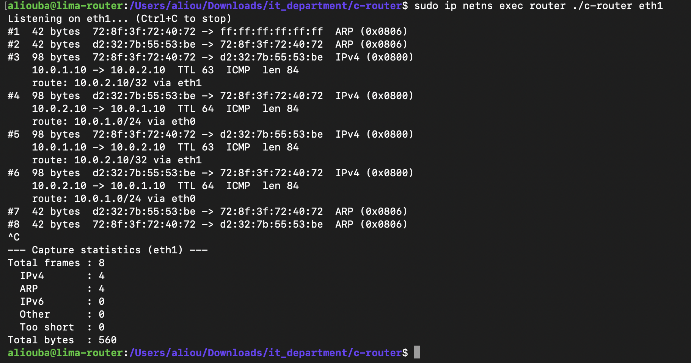
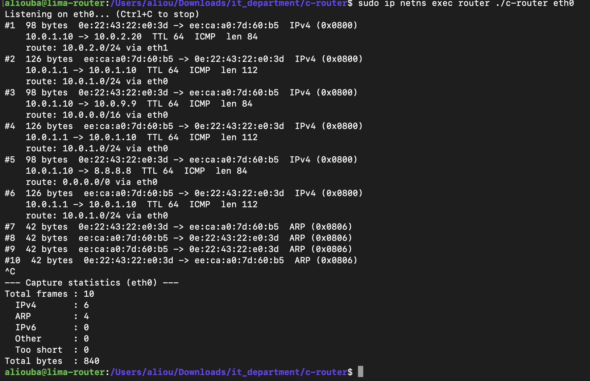

# M4: Routing Table

## Goal

For every IPv4 packet, decide which interface it must leave through, using a routing table. This is the core decision of a router. At this stage the program prints the decision only; the Linux kernel still forwards the packets (sending them out is M5).

## Static routes

The router starts with an empty table, so the routes are written in the code before it runs. This is static routing, the same as typing `ip route` on a Cisco router:

| Cisco IOS | This router (`src/main.c`) |
|---|---|
| `ip route 10.0.1.0 255.255.255.0 Gi0/0` | `{ {10,0,1,0}, {255,255,255,0}, "eth0", "10.0.1.0/24" }` |
| `ip route 10.0.2.0 255.255.255.0 Gi0/1` | `{ {10,0,2,0}, {255,255,255,0}, "eth1", "10.0.2.0/24" }` |

These are the two networks directly connected to the router in the lab:

```text
pc-a ── 10.0.1.0/24 ── eth0 [ROUTER] eth1 ── 10.0.2.0/24 ── pc-b
```

Later milestones will load routes from a configuration file (M11) instead of the code.

## Matching a destination against a route

The packet carries one destination address (bytes 30-33 of the frame, decoded in M3). A route describes a range of addresses: a network and a mask.

For each of the 4 numbers of the address, the destination is ANDed with the mask and compared with the network, like the ANDing used in subnetting:

- `number & 255` keeps the number (this position must match)
- `number & 0` gives 0 (this position is ignored)

Example: destination `10.0.2.10` against the route `10.0.2.0 / 255.255.255.0`:

```text
10 & 255 = 10   vs 10   same
 0 & 255 = 0    vs 0    same
 2 & 255 = 2    vs 2    same
10 & 0   = 0    vs 0    same     -> match, send out eth1
```

Against `10.0.1.0 / 255.255.255.0`, the third number gives `2` instead of `1`, so it does not match.

## Code structure

```c
struct route {
    unsigned char network[4];
    unsigned char mask[4];
    const char   *door;   /* interface, e.g. "eth1" */
    const char   *text;   /* for printing, e.g. "10.0.2.0/24" */
};

#define ROUTE_COUNT 2
static const struct route routing_table[ROUTE_COUNT] = { ... };
```

- `route_matches(dest, line)`: compares the destination with one line of the table. Returns 1 if it fits, 0 otherwise.
- `lookup_route(dest)`: tries each line in order. Returns the number of the first line that fits, or -1 if none does.
- In `print_ipv4`, the destination IP is looked up and the result is printed: `route: <network> via <interface>`, or `route: none, drop`.

`ROUTE_COUNT` is used both for the size of the table and for the loop, so adding a route only requires changing one number.

## Algorithm

```text
FOR each line of the table:
    FOR each of the 4 numbers:
        IF (destination AND mask) != network: this line does not fit
    IF all 4 numbers fit: RETURN this line
RETURN "no route"
```

## Test 1: ping from pc-a to pc-b, captured on eth1

```bash
sudo ip netns exec router ./c-router eth1
sudo ip netns exec pc-a ping -c 3 10.0.2.10
```


```text
Listening on eth1... (Ctrl+C to stop)
#1  42 bytes  9a:49:47:8b:c6:a6 -> ff:ff:ff:ff:ff:ff  ARP (0x0806)
#2  42 bytes  c2:d6:69:e3:55:eb -> 9a:49:47:8b:c6:a6  ARP (0x0806)
#3  98 bytes  9a:49:47:8b:c6:a6 -> c2:d6:69:e3:55:eb  IPv4 (0x0800)
    10.0.1.10 -> 10.0.2.10  TTL 63  ICMP  len 84
    route: 10.0.2.0/24 via eth1
#4  98 bytes  c2:d6:69:e3:55:eb -> 9a:49:47:8b:c6:a6  IPv4 (0x0800)
    10.0.2.10 -> 10.0.1.10  TTL 64  ICMP  len 84
    route: 10.0.1.0/24 via eth0
#5  98 bytes  9a:49:47:8b:c6:a6 -> c2:d6:69:e3:55:eb  IPv4 (0x0800)
    10.0.1.10 -> 10.0.2.10  TTL 63  ICMP  len 84
    route: 10.0.2.0/24 via eth1
#6  98 bytes  c2:d6:69:e3:55:eb -> 9a:49:47:8b:c6:a6  IPv4 (0x0800)
    10.0.2.10 -> 10.0.1.10  TTL 64  ICMP  len 84
    route: 10.0.1.0/24 via eth0
#7  98 bytes  9a:49:47:8b:c6:a6 -> c2:d6:69:e3:55:eb  IPv4 (0x0800)
    10.0.1.10 -> 10.0.2.10  TTL 63  ICMP  len 84
    route: 10.0.2.0/24 via eth1
#8  98 bytes  c2:d6:69:e3:55:eb -> 9a:49:47:8b:c6:a6  IPv4 (0x0800)
    10.0.2.10 -> 10.0.1.10  TTL 64  ICMP  len 84
    route: 10.0.1.0/24 via eth0
#9  42 bytes  c2:d6:69:e3:55:eb -> 9a:49:47:8b:c6:a6  ARP (0x0806)
#10  42 bytes  9a:49:47:8b:c6:a6 -> c2:d6:69:e3:55:eb  ARP (0x0806)
^C
--- Capture statistics (eth1) ---
Total frames : 10
  IPv4       : 6
  ARP        : 4
  IPv6       : 0
  Other      : 0
  Too short  : 0
Total bytes  : 756
```

**Result:** the requests to pc-b (10.0.2.10) match `10.0.2.0/24` and go out eth1. The replies to pc-a (10.0.1.10) match `10.0.1.0/24` and go out eth0. This is the same decision the Linux kernel made, since the ping succeeded.

## Test 2: destination with no route, captured on eth0

```bash
sudo ip netns exec router ./c-router eth0
sudo ip netns exec pc-a ping -c 2 8.8.8.8
```


```text
Listening on eth0... (Ctrl+C to stop)
#1  98 bytes  12:bf:ee:cb:e0:59 -> ea:51:9b:72:98:9a  IPv4 (0x0800)
    10.0.1.10 -> 8.8.8.8  TTL 64  ICMP  len 84
    route: none, drop
#2  126 bytes  ea:51:9b:72:98:9a -> 12:bf:ee:cb:e0:59  IPv4 (0x0800)
    10.0.1.1 -> 10.0.1.10  TTL 64  ICMP  len 112
    route: 10.0.1.0/24 via eth0
#3  98 bytes  12:bf:ee:cb:e0:59 -> ea:51:9b:72:98:9a  IPv4 (0x0800)
    10.0.1.10 -> 8.8.8.8  TTL 64  ICMP  len 84
    route: none, drop
#4  126 bytes  ea:51:9b:72:98:9a -> 12:bf:ee:cb:e0:59  IPv4 (0x0800)
    10.0.1.1 -> 10.0.1.10  TTL 64  ICMP  len 112
    route: 10.0.1.0/24 via eth0
#5  42 bytes  ea:51:9b:72:98:9a -> 12:bf:ee:cb:e0:59  ARP (0x0806)
#6  42 bytes  12:bf:ee:cb:e0:59 -> ea:51:9b:72:98:9a  ARP (0x0806)
#7  42 bytes  ea:51:9b:72:98:9a -> 12:bf:ee:cb:e0:59  ARP (0x0806)
#8  42 bytes  12:bf:ee:cb:e0:59 -> ea:51:9b:72:98:9a  ARP (0x0806)
^C
--- Capture statistics (eth0) ---
Total frames : 8
  IPv4       : 4
  ARP        : 4
  IPv6       : 0
  Other      : 0
  Too short  : 0
Total bytes  : 616
```

**Result:** `8.8.8.8` matches no line of the table, so the program reports `route: none, drop`. There is no default route (`0.0.0.0/0`) in the table.

### The 126-byte packets from 10.0.1.1

Frames #2 and #4 were not sent by pc-a. They come from the router itself (10.0.1.1 is router eth0). The Linux kernel on the router also has no route to 8.8.8.8, so it answers pc-a with an **ICMP Destination Unreachable** message.

Its size shows what it contains:

```text
20 bytes   new IPv4 header      (10.0.1.1 -> 10.0.1.10)
 8 bytes   ICMP "unreachable" header
84 bytes   copy of pc-a's original packet, so pc-a knows which packet failed
---------
112 bytes  IPv4 length  (+ 14 Ethernet = 126 bytes on the wire)
```

This is the behaviour the C router will implement itself in M6 (ICMP).

### Byte count check

```text
2 x 98  (pings to 8.8.8.8)    = 196
2 x 126 (ICMP unreachable)    = 252
4 x 42  (ARP)                 = 168
                        Total = 616 bytes
```

## Part 2: default route and longest prefix match

### The problem

The first version returned the **first** line that fits. That only works when routes never overlap. A default route (`0.0.0.0/0`, mask `0.0.0.0`) fits **every** address, so if it came first, it would catch all packets, including the ones for pc-b.

Routers solve this with **longest prefix match**: when several routes fit, the most specific one wins, meaning the one with the largest prefix length (the number after the `/`). The order of the table does not matter.

| Prefix | Mask | What must match |
|---|---|---|
| `/0`  | `0.0.0.0`         | nothing: every address fits (default route) |
| `/16` | `255.255.0.0`     | the first 2 numbers |
| `/24` | `255.255.255.0`   | the first 3 numbers |
| `/32` | `255.255.255.255` | all 4 numbers: one exact address (host route) |

### The new table

Each route now also stores its prefix length. The default route is placed first on purpose, to prove that the order no longer matters.

```c
#define ROUTE_COUNT 5

static const struct route routing_table[ROUTE_COUNT] = {
    { {0, 0, 0, 0},    {0, 0, 0, 0},         0,  "eth0", "0.0.0.0/0"    },   /* default route */
    { {10, 0, 0, 0},   {255, 255, 0, 0},     16, "eth0", "10.0.0.0/16"  },
    { {10, 0, 1, 0},   {255, 255, 255, 0},   24, "eth0", "10.0.1.0/24"  },
    { {10, 0, 2, 0},   {255, 255, 255, 0},   24, "eth1", "10.0.2.0/24"  },
    { {10, 0, 2, 10},  {255, 255, 255, 255}, 32, "eth1", "10.0.2.10/32" },   /* host route */
};
```

Cisco equivalent:

```text
ip route 0.0.0.0   0.0.0.0         Gi0/0
ip route 10.0.0.0  255.255.0.0     Gi0/0
ip route 10.0.1.0  255.255.255.0   Gi0/0
ip route 10.0.2.0  255.255.255.0   Gi0/1
ip route 10.0.2.10 255.255.255.255 Gi0/1
```

### The new lookup

`route_matches` is unchanged. `lookup_route` no longer stops at the first fit: it checks every line and keeps the one with the largest prefix.

```c
static int lookup_route(const unsigned char *dest)
{
    int best = -1;                          /* no winner yet */

    for (int line = 0; line < ROUTE_COUNT; line++) {
        if (route_matches(dest, line)) {
            if (best == -1 || routing_table[line].prefix > routing_table[best].prefix) {
                best = line;                /* more precise than the previous winner */
            }
        }
    }
    return best;
}
```

`best` starts at `-1`, meaning "no winner yet". With a default route in the table, every address fits at least line 0, so `-1` is never returned. It remains as a safety net: if the default route is removed, a destination that fits nothing still returns `-1` and is reported as `route: none, drop`.

### Worked example: destination 10.0.2.10

```text
line 0  0.0.0.0/0     fits  -> best = line 0 (/0)
line 1  10.0.0.0/16   fits  -> /16 > /0  -> best = line 1
line 2  10.0.1.0/24   no    (10.0.2 != 10.0.1)
line 3  10.0.2.0/24   fits  -> /24 > /16 -> best = line 3
line 4  10.0.2.10/32  fits  -> /32 > /24 -> best = line 4
winner: 10.0.2.10/32 via eth1
```

### Test 3: the host route wins, captured on eth1

```bash
sudo ip netns exec router ./c-router eth1
sudo ip netns exec pc-a ping -c 2 10.0.2.10
```



```text
Listening on eth1... (Ctrl+C to stop)
#1  42 bytes  72:8f:3f:72:40:72 -> ff:ff:ff:ff:ff:ff  ARP (0x0806)
#2  42 bytes  d2:32:7b:55:53:be -> 72:8f:3f:72:40:72  ARP (0x0806)
#3  98 bytes  72:8f:3f:72:40:72 -> d2:32:7b:55:53:be  IPv4 (0x0800)
    10.0.1.10 -> 10.0.2.10  TTL 63  ICMP  len 84
    route: 10.0.2.10/32 via eth1
#4  98 bytes  d2:32:7b:55:53:be -> 72:8f:3f:72:40:72  IPv4 (0x0800)
    10.0.2.10 -> 10.0.1.10  TTL 64  ICMP  len 84
    route: 10.0.1.0/24 via eth0
#5  98 bytes  72:8f:3f:72:40:72 -> d2:32:7b:55:53:be  IPv4 (0x0800)
    10.0.1.10 -> 10.0.2.10  TTL 63  ICMP  len 84
    route: 10.0.2.10/32 via eth1
#6  98 bytes  d2:32:7b:55:53:be -> 72:8f:3f:72:40:72  IPv4 (0x0800)
    10.0.2.10 -> 10.0.1.10  TTL 64  ICMP  len 84
    route: 10.0.1.0/24 via eth0
#7  42 bytes  d2:32:7b:55:53:be -> 72:8f:3f:72:40:72  ARP (0x0806)
#8  42 bytes  72:8f:3f:72:40:72 -> d2:32:7b:55:53:be  ARP (0x0806)
^C
--- Capture statistics (eth1) ---
Total frames : 8
  IPv4       : 4
  ARP        : 4
  IPv6       : 0
  Other      : 0
  Too short  : 0
Total bytes  : 560
```

**Result:** four routes fit 10.0.2.10 (`/0`, `/16`, `/24`, `/32`) and the `/32` host route wins. Replies to 10.0.1.10 fit `/0`, `/16` and `10.0.1.0/24`, and the `/24` wins.

Byte check: 4 x 98 + 4 x 42 = 392 + 168 = 560 bytes.

### Test 4: /24, /16 and the default route, captured on eth0

```bash
sudo ip netns exec router ./c-router eth0
sudo ip netns exec pc-a ping -c 1 10.0.2.20
sudo ip netns exec pc-a ping -c 1 10.0.9.9
sudo ip netns exec pc-a ping -c 1 8.8.8.8
```



```text
Listening on eth0... (Ctrl+C to stop)
#1  98 bytes  0e:22:43:22:e0:3d -> ee:ca:a0:7d:60:b5  IPv4 (0x0800)
    10.0.1.10 -> 10.0.2.20  TTL 64  ICMP  len 84
    route: 10.0.2.0/24 via eth1
#2  126 bytes  ee:ca:a0:7d:60:b5 -> 0e:22:43:22:e0:3d  IPv4 (0x0800)
    10.0.1.1 -> 10.0.1.10  TTL 64  ICMP  len 112
    route: 10.0.1.0/24 via eth0
#3  98 bytes  0e:22:43:22:e0:3d -> ee:ca:a0:7d:60:b5  IPv4 (0x0800)
    10.0.1.10 -> 10.0.9.9  TTL 64  ICMP  len 84
    route: 10.0.0.0/16 via eth0
#4  126 bytes  ee:ca:a0:7d:60:b5 -> 0e:22:43:22:e0:3d  IPv4 (0x0800)
    10.0.1.1 -> 10.0.1.10  TTL 64  ICMP  len 112
    route: 10.0.1.0/24 via eth0
#5  98 bytes  0e:22:43:22:e0:3d -> ee:ca:a0:7d:60:b5  IPv4 (0x0800)
    10.0.1.10 -> 8.8.8.8  TTL 64  ICMP  len 84
    route: 0.0.0.0/0 via eth0
#6  126 bytes  ee:ca:a0:7d:60:b5 -> 0e:22:43:22:e0:3d  IPv4 (0x0800)
    10.0.1.1 -> 10.0.1.10  TTL 64  ICMP  len 112
    route: 10.0.1.0/24 via eth0
#7  42 bytes  0e:22:43:22:e0:3d -> ee:ca:a0:7d:60:b5  ARP (0x0806)
#8  42 bytes  ee:ca:a0:7d:60:b5 -> 0e:22:43:22:e0:3d  ARP (0x0806)
#9  42 bytes  ee:ca:a0:7d:60:b5 -> 0e:22:43:22:e0:3d  ARP (0x0806)
#10  42 bytes  0e:22:43:22:e0:3d -> ee:ca:a0:7d:60:b5  ARP (0x0806)
^C
--- Capture statistics (eth0) ---
Total frames : 10
  IPv4       : 6
  ARP        : 4
  IPv6       : 0
  Other      : 0
  Too short  : 0
Total bytes  : 840
```

**Result:**

| Destination | Routes that fit | Winner |
|---|---|---|
| 10.0.2.20 | `/0`, `/16`, `10.0.2.0/24` (the `/32` does not fit: 20 != 10) | `10.0.2.0/24 via eth1` |
| 10.0.9.9 | `/0`, `/16` | `10.0.0.0/16 via eth0` |
| 8.8.8.8 | `/0` only | `0.0.0.0/0 via eth0` (default route) |

8.8.8.8 is no longer dropped: the default route catches it. Frames #2, #4 and #6 are ICMP Destination Unreachable messages sent by the Linux kernel on the router (10.0.1.1), because the kernel itself has no route to these destinations (see Test 2).

Byte check: 3 x 98 + 3 x 126 + 4 x 42 = 294 + 378 + 168 = 840 bytes.

## Limitations

- **Decision only.** The packet is not forwarded by the program yet: the Linux kernel still does the forwarding (M5).
- **Linear search.** Every packet checks every line of the table. This is fine for 5 routes; real routers use tree structures (tries) to handle hundreds of thousands of routes quickly.
- **Routes are written in the code.** Loading them from a configuration file comes in M11.

## Status

- [x] Static routing table in the code
- [x] Route lookup with network and mask
- [x] Tested: routed traffic and a destination with no route
- [x] Default route and longest prefix match (host route /32, /24, /16, /0)

**M4 complete.**
