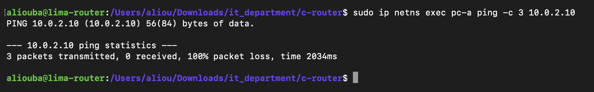
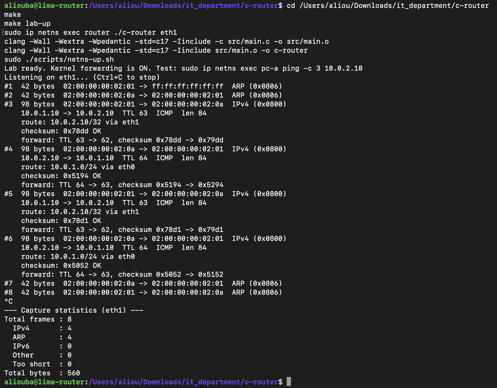
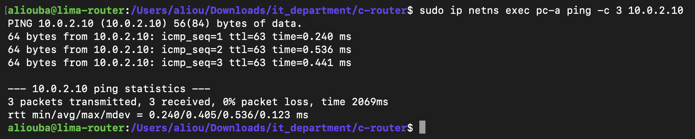
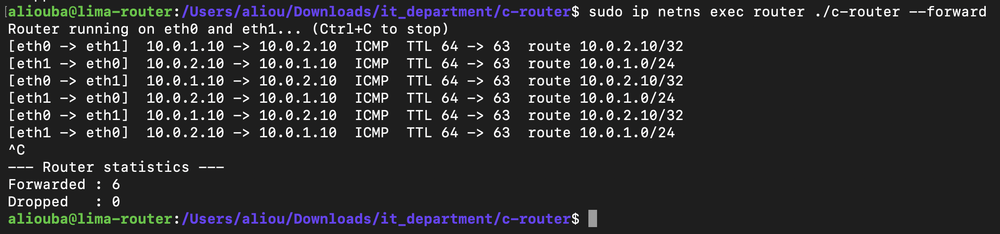
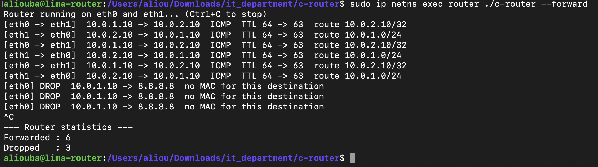

# M5: Packet Forwarding

## Goal

Turn the program from an observer into a router. Linux forwarding is switched off in the router namespace, and the C program receives each packet, decides where it goes, modifies it and sends it out of the right interface. The ping between pc-a and pc-b works only while the program runs.

```text
Before (M1 to M4):  pc-a ──► [ Linux forwards ] ──► pc-b     (the program only watches)
M5:                 pc-a ──► [ C program forwards ] ──► pc-b  (Linux forwarding OFF)
```

## What a router changes in a packet

| Field | Arriving from pc-a | Leaving to pc-b |
|---|---|---|
| Destination MAC | router eth0 `02:00:00:00:01:01` | pc-b `02:00:00:00:02:0a` |
| Source MAC | pc-a `02:00:00:00:01:0a` | router eth1 `02:00:00:00:02:01` |
| TTL (byte 22) | 64 | 63 |
| Header checksum (bytes 24-25) | old value | recalculated |
| Source and destination IP | 10.0.1.10 -> 10.0.2.10 | unchanged |

## Lab changes

**Fixed MAC addresses** (`scripts/netns-up.sh`). Linux gives veth interfaces random MACs, so the router could not know them in advance. The lab now sets fixed MACs, with the pattern `02:00:00:00:<network>:<host>`:

| Interface | IP | MAC |
|---|---|---|
| pc-a eth0 | 10.0.1.10 | `02:00:00:00:01:0a` |
| router eth0 | 10.0.1.1 | `02:00:00:00:01:01` |
| router eth1 | 10.0.2.1 | `02:00:00:00:02:01` |
| pc-b eth0 | 10.0.2.10 | `02:00:00:00:02:0a` |

**Two lab modes:**

| Command | Linux forwarding | Used for |
|---|---|---|
| `make lab-up` | ON | M1 to M4 (the program observes) |
| `make lab-router` | OFF | M5 (the program must forward) |

## Algorithm

```text
SETUP
    open one raw socket per interface (eth0, eth1)
    fixed tables: the router's own MACs and IPs, and the neighbours' MACs (static ARP)

LOOP until Ctrl+C
    wait until eth0 or eth1 has a packet                       (poll)
    receive it, with its direction                             (recvfrom)
    ignore it if:
        - we sent it ourselves (outgoing)
        - it is not IPv4, or not addressed to this interface's MAC (ARP, broadcasts: left to Linux)
        - it is addressed to the router's own IP (left to Linux)
    drop it if:
        - the IPv4 header or the checksum is invalid
        - no route matches                                     (M4)
        - TTL <= 1
        - the next machine's MAC is unknown
    otherwise:
        TTL = TTL - 1
        recalculate the header checksum
        destination MAC = next machine, source MAC = outgoing interface
        send it out of the outgoing interface                  (send)
```

## Key techniques

### Listening on two interfaces: `poll()`

`recv()` blocks on one socket. A router must watch both interfaces, so the program uses `poll()`, which sleeps until **any** of the sockets has a packet and reports which one.

```c
int ready = poll(watch, IFACE_COUNT, -1);
for (int i = 0; i < IFACE_COUNT; i++) {
    if (watch[i].revents & POLLIN) {
        handle_packet(i);
    }
}
```

### Ignoring our own packets

A raw socket sees every frame on its interface, including the ones the program has just sent. Without a check, the router would receive its own output and forward it again in a loop. `recvfrom()` reports the direction, and outgoing frames are skipped:

```c
if (from.sll_pkttype == PACKET_OUTGOING) {
    return;
}
```

### The IPv4 header checksum

The checksum protects the 20-byte header. Because the TTL changes, it must be recalculated, or the receiver discards the packet.

1. Read the header as ten 2-byte numbers (`byte * 256 + next byte`) and add them, counting the checksum field as 0.
2. Fold: while the sum is larger than 65535, add the overflow back (`sum % 65536 + sum / 65536`).
3. Flip: `checksum = 65535 - sum`.

Worked example, ping header `45 00 00 54 1c 46 40 00 3f 01 [08 50] 0a 00 01 0a 0a 00 02 0a`:

```text
17664 + 84 + 7238 + 16384 + 16129 + 0 + 2560 + 266 + 2560 + 522 = 63407
65535 - 63407 = 2128 = 0x0850   (matches the packet)
After TTL 63 -> 62: 0x0950
```

### Static ARP

Discovering MACs automatically is ARP (M7). For now, the neighbours' MACs are written in a small table, the equivalent of static ARP entries on a Cisco router.

## Test 1: Linux forwarding OFF, no C router running

```bash
make lab-router
sudo ip netns exec pc-a ping -c 3 10.0.2.10
```



```text
PING 10.0.2.10 (10.0.2.10) 56(84) bytes of data.

--- 10.0.2.10 ping statistics ---
3 packets transmitted, 0 received, 100% packet loss, time 2034ms
```

Nothing forwards the packets any more: pc-b is unreachable.

## Test 2: checksum verification (Linux forwarding ON, observer mode)

Before sending anything, the checksum function was checked against real packets: it must give the same value Linux wrote in each packet.

```bash
make lab-up
sudo ip netns exec router ./c-router eth1
sudo ip netns exec pc-a ping -c 2 10.0.2.10
```



```text
#3  98 bytes  02:00:00:00:02:01 -> 02:00:00:00:02:0a  IPv4 (0x0800)
    10.0.1.10 -> 10.0.2.10  TTL 63  ICMP  len 84
    route: 10.0.2.10/32 via eth1
    checksum: 0x78dd OK
    forward: TTL 63 -> 62, checksum 0x78dd -> 0x79dd
#4  98 bytes  02:00:00:00:02:0a -> 02:00:00:00:02:01  IPv4 (0x0800)
    10.0.2.10 -> 10.0.1.10  TTL 64  ICMP  len 84
    route: 10.0.1.0/24 via eth0
    checksum: 0x5194 OK
    forward: TTL 64 -> 63, checksum 0x5194 -> 0x5294
#5  98 bytes  02:00:00:00:02:01 -> 02:00:00:00:02:0a  IPv4 (0x0800)
    10.0.1.10 -> 10.0.2.10  TTL 63  ICMP  len 84
    route: 10.0.2.10/32 via eth1
    checksum: 0x78d1 OK
    forward: TTL 63 -> 62, checksum 0x78d1 -> 0x79d1
#6  98 bytes  02:00:00:00:02:0a -> 02:00:00:00:02:01  IPv4 (0x0800)
    10.0.2.10 -> 10.0.1.10  TTL 64  ICMP  len 84
    route: 10.0.1.0/24 via eth0
    checksum: 0x5052 OK
    forward: TTL 64 -> 63, checksum 0x5052 -> 0x5152
```

**Result:** every checksum is `OK`, so the function computes exactly like Linux. Each new checksum is the old one plus `0x0100`: the TTL is the high byte of its 2-byte pair, so lowering it by 1 raises the flipped sum by `0x0100`. The fixed MACs (`02:00:00:00:02:01`, `02:00:00:00:02:0a`) are visible in the capture.

## Test 3: the C router forwards the ping

```bash
make lab-router
sudo ip netns exec router ./c-router --forward     # terminal 1
sudo ip netns exec pc-a ping -c 3 10.0.2.10        # terminal 2
```

**pc-a:**



```text
PING 10.0.2.10 (10.0.2.10) 56(84) bytes of data.
64 bytes from 10.0.2.10: icmp_seq=1 ttl=63 time=0.240 ms
64 bytes from 10.0.2.10: icmp_seq=2 ttl=63 time=0.536 ms
64 bytes from 10.0.2.10: icmp_seq=3 ttl=63 time=0.441 ms

--- 10.0.2.10 ping statistics ---
3 packets transmitted, 3 received, 0% packet loss, time 2069ms
rtt min/avg/max/mdev = 0.240/0.405/0.536/0.123 ms
```

**The C router:**



```text
Router running on eth0 and eth1... (Ctrl+C to stop)
[eth0 -> eth1]  10.0.1.10 -> 10.0.2.10  ICMP  TTL 64 -> 63  route 10.0.2.10/32
[eth1 -> eth0]  10.0.2.10 -> 10.0.1.10  ICMP  TTL 64 -> 63  route 10.0.1.0/24
[eth0 -> eth1]  10.0.1.10 -> 10.0.2.10  ICMP  TTL 64 -> 63  route 10.0.2.10/32
[eth1 -> eth0]  10.0.2.10 -> 10.0.1.10  ICMP  TTL 64 -> 63  route 10.0.1.0/24
[eth0 -> eth1]  10.0.1.10 -> 10.0.2.10  ICMP  TTL 64 -> 63  route 10.0.2.10/32
[eth1 -> eth0]  10.0.2.10 -> 10.0.1.10  ICMP  TTL 64 -> 63  route 10.0.1.0/24
^C
--- Router statistics ---
Forwarded : 6
Dropped   : 0
```

**Result:** with Linux forwarding off, the ping succeeds with `ttl=63`: one router decremented the TTL, and that router is the C program. Requests use the `/32` host route through eth1, replies use `10.0.1.0/24` through eth0.

## Test 4: a destination the router cannot reach

With the router running, pc-a pings 8.8.8.8.



```text
[eth0] DROP  10.0.1.10 -> 8.8.8.8  no MAC for this destination
[eth0] DROP  10.0.1.10 -> 8.8.8.8  no MAC for this destination
[eth0] DROP  10.0.1.10 -> 8.8.8.8  no MAC for this destination
^C
--- Router statistics ---
Forwarded : 6
Dropped   : 3
```

**Result:** the default route matches 8.8.8.8, but there is no machine behind it in the lab, so the router has no MAC to deliver to and drops the packet with a clear reason instead of sending it blindly.

## Summary

| Test | C router | Linux forwarding | Ping |
|---|---|---|---|
| 1 | not running | OFF | 100% loss |
| 3 | running | OFF | 0% loss, ttl=63 |

The network only works when the C program runs: the program is the router.

## Limitations

- **Static ARP.** Neighbour MACs are written in the code. Dynamic ARP is M7.
- **No ICMP errors.** Dropped packets are not reported to the sender (TTL exceeded, destination unreachable). This is M6, and it is what makes `traceroute` work.
- **Next hop = destination.** Only directly connected networks are supported. Routes through another router (a gateway) are not implemented yet.
- **One packet at a time.** A single loop handles every packet. Throughput and multithreading are measured and improved in M13 and M14.

## Status

- [x] Lab with fixed MACs and kernel forwarding OFF
- [x] Header checksum, verified against real packets
- [x] Listening on two interfaces with `poll()`
- [x] Full forwarding: TTL, checksum, MAC rewrite, send
- [x] Tested: ping through the C router, and drops with a reason

**M5 complete.**
