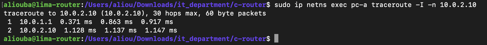
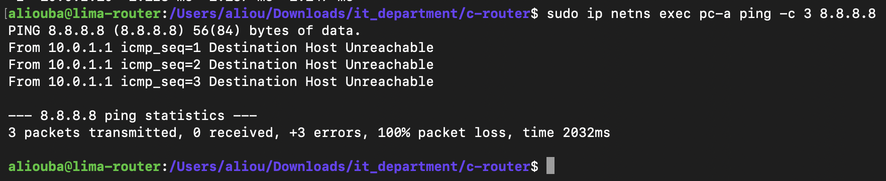

# M6: ICMP Error Messages

## Goal

When the router drops a packet, tell the sender why, instead of staying silent. The router builds an ICMP error message and sends it back to the source. This is what real routers do, and it is what makes `traceroute` work.

## The two messages

| Situation | ICMP message | Type | Code |
|---|---|---|---|
| TTL would reach 0 | Time Exceeded | 11 | 0 |
| No route to the destination | Destination Unreachable (network) | 3 | 0 |
| Route found, but no MAC for the destination | Destination Unreachable (host) | 3 | 1 |

### How traceroute uses Time Exceeded

traceroute sends probes with TTL 1, then 2, then 3. Each router that drops a probe because its TTL ran out answers with Time Exceeded, using its own IP address as the source. traceroute prints that address as the hop. The destination itself answers the probe that reaches it.

## Structure of the error message (70 bytes)

The router creates a new frame and sends it back out of the interface the original packet came in on.

```text
Ethernet (14)  destination = original sender's MAC    source = router's MAC on that interface
IPv4 (20)      source = router's IP on that interface (10.0.1.1)
               destination = original sender (10.0.1.10)
               TTL 64, protocol 1 (ICMP)
ICMP (8)       type, code, checksum, 4 unused bytes
Copy (28)      the original packet's IP header (20 bytes) + its first 8 bytes
```

The copy lets the sender match the error to the packet that caused it: `ping` and `traceroute` use it to identify their probe.

Size: 14 + 20 + 8 + 28 = 70 bytes.

## The ICMP checksum

The ICMP checksum uses the same calculation as the IPv4 header checksum (add 2-byte pairs, fold, flip), but over the whole ICMP message (header + copied data, 36 bytes). A general function, `inet_checksum(data, length)`, handles any length, including an odd number of bytes. It was checked against a reference calculation, and recomputing it over a finished message gives 0, which is how a receiver validates it.

## Safety rule

The router never sends an ICMP error about an ICMP error (only ICMP echo request and echo reply may trigger one). Otherwise two routers could send errors to each other forever. This rule comes from the ICMP standard (RFC 792 / RFC 1122).

## Code structure

```c
static unsigned int inet_checksum(const unsigned char *data, unsigned int length);

static void send_icmp_error(int in, const unsigned char *orig,
                            unsigned int header_size, unsigned int total_size,
                            unsigned char type, unsigned char code);
```

In `handle_packet`, the three silent drops of M5 now answer the sender:

```c
drop(..., "no route");
send_icmp_error(in, frame, header_size, total_size, ICMP_DEST_UNREACHABLE, 0);

drop(..., "TTL expired");
send_icmp_error(in, frame, header_size, total_size, ICMP_TIME_EXCEEDED, 0);

drop(..., "no MAC for this destination");
send_icmp_error(in, frame, header_size, total_size, ICMP_DEST_UNREACHABLE, 1);
```

The router statistics now include the number of ICMP messages sent.

## Test 1: traceroute through the C router

```bash
make lab-router
sudo ip netns exec router ./c-router --forward       # terminal 1
sudo ip netns exec pc-a traceroute -I -n 10.0.2.10   # terminal 2
```



```text
traceroute to 10.0.2.10 (10.0.2.10), 30 hops max, 60 byte packets
 1  10.0.1.1   0.371 ms  0.863 ms  0.917 ms
 2  10.0.2.10  1.128 ms  1.137 ms  1.147 ms
```

**Result:** hop 1 is 10.0.1.1. Linux forwarding is off, so this answer can only come from the C router: it dropped the TTL 1 probes and sent Time Exceeded from its eth0 address. Hop 2 is pc-b, reached through the router.

`-I` makes traceroute send ICMP echo probes. With the default UDP probes, veth checksum offloading leaves the UDP checksum incomplete in the captured frame; this is handled in M8.

## Test 2: Destination Host Unreachable

```bash
sudo ip netns exec pc-a ping -c 3 8.8.8.8
```



```text
PING 8.8.8.8 (8.8.8.8) 56(84) bytes of data.
From 10.0.1.1 icmp_seq=1 Destination Host Unreachable
From 10.0.1.1 icmp_seq=2 Destination Host Unreachable
From 10.0.1.1 icmp_seq=3 Destination Host Unreachable

--- 8.8.8.8 ping statistics ---
3 packets transmitted, 0 received, +3 errors, 100% packet loss, time 2032ms
```

**Result:** in M5 this ping waited in silence. Now the default route matches 8.8.8.8, but the router has no MAC for it, so it answers with Destination Unreachable (code 1, host). `ping` recognises its own packets in the copied data and reports `+3 errors` instead of plain timeouts.

## Limitations

- **No rate limiting.** Real routers limit how many ICMP errors they send per second, to avoid being used to flood a network.
- **The router does not answer pings to itself.** Packets addressed to 10.0.1.1 or 10.0.2.1 are still left to Linux.

## Status

- [x] General checksum function for any length
- [x] ICMP Time Exceeded (TTL expired)
- [x] ICMP Destination Unreachable (network and host)
- [x] No ICMP error in response to an ICMP error
- [x] Tested: traceroute through the router, and unreachable destination

**M6 complete.**
