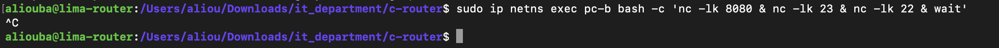
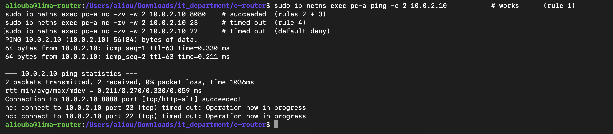
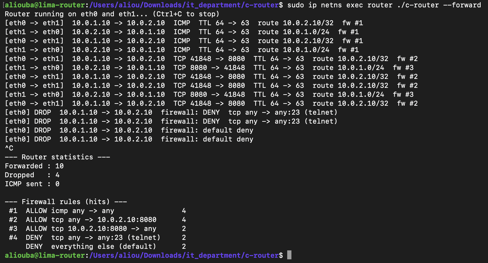

# M9: Firewall

## Goal

Decide, for every packet the router forwards, whether it is allowed to pass. The rules work like a Cisco ACL: they are checked from top to bottom, the first rule that matches decides, and a packet that matches no rule is denied.

## Where the firewall sits

The check runs inside `handle_packet`, after the IPv4 header is validated and before the route lookup. There is no reason to route a packet that will be blocked.

```text
receive -> validate IPv4 -> FIREWALL -> route lookup -> TTL -> neighbor MAC -> rewrite -> send
                               |
                               +-- deny: drop silently (no ICMP error)
```

## The rule table

| # | Action | Protocol | Source | Destination | Why |
|---|---|---|---|---|---|
| 1 | ALLOW | ICMP | any | any | ping and traceroute keep working |
| 2 | ALLOW | TCP | any | 10.0.2.10 port 8080 | the web server on pc-b |
| 3 | ALLOW | TCP | 10.0.2.10 port 8080 | any | the server's answers |
| 4 | DENY | TCP | any | any port 23 | telnet is blocked explicitly |
| - | DENY | any | any | any | default: everything else |

Each rule matches on 5 fields: protocol, source network, destination network, source port, destination port. "any" is written as network `0.0.0.0` with mask `0.0.0.0`, and port `0`.

### Why rule 3 is needed

This firewall is **stateless**: it looks at each packet alone and has no memory of the connection it belongs to. Rule 2 lets pc-a's packets reach port 8080, but pc-b's replies travel the other way (source port 8080, destination a random port such as 41848). Without rule 3 those replies would hit the default deny and the connection would never open. A stateful firewall (connection tracking) removes the need for this rule; that comes later with NAT.

## Reading the ports

TCP and UDP both start with the source port and the destination port, 2 bytes each. Their header begins right after the IPv4 header, at byte `14 + IPv4 header size` (byte 34 when the header is 20 bytes).

```text
bytes 34-35  source port       1F 90  ->  31 x 256 + 144 = 8080
bytes 36-37  destination port
```

ICMP has no ports, so both stay 0 and only rules with "any port" can match it.

## Code

| Function | Job |
|---|---|
| `ip_in_net(ip, net, mask)` | 1 if `ip AND mask == net`, else 0 (same test as the routing table) |
| `read_ports(...)` | reads the two ports for TCP/UDP, returns 0 if the packet is too short |
| `check_firewall(...)` | loops over the rules, returns the index of the first match, or -1 (default deny). Counts hits. |

```c
for (int r = 0; r < FW_RULE_COUNT; r++) {
    if (fw_rules[r].protocol != PROTO_ANY && fw_rules[r].protocol != protocol)  continue;
    if (!ip_in_net(frame + 26, fw_rules[r].src_net, fw_rules[r].src_mask))      continue;
    if (!ip_in_net(frame + 30, fw_rules[r].dst_net, fw_rules[r].dst_mask))      continue;
    if (fw_rules[r].src_port != PORT_ANY && fw_rules[r].src_port != src_port)   continue;
    if (fw_rules[r].dst_port != PORT_ANY && fw_rules[r].dst_port != dst_port)   continue;
    fw_rules[r].hits++;
    return r;                 /* first match wins */
}
fw_default_hits++;
return -1;                    /* default deny */
```

## Lab fix: TX checksum offload

On veth interfaces Linux leaves TCP/UDP checksums unfinished, expecting the network card to complete them. When our C router copies those packets, pc-b receives a wrong checksum and throws them away. `scripts/netns-up.sh` now turns this off on both PCs:

```bash
ip netns exec pc-a ethtool -K eth0 tx off
ip netns exec pc-b ethtool -K eth0 tx off
```

## Test

```bash
make lab-router                                             # kernel forwarding OFF
sudo ip netns exec router ./c-router --forward              # terminal 1
sudo ip netns exec pc-b bash -c 'nc -lk 8080 & nc -lk 23 & nc -lk 22 & wait'   # terminal 2
```

pc-b listens on 3 ports, so any failure comes from the firewall, not from a closed port.



From pc-a (terminal 3):

```bash
sudo ip netns exec pc-a ping -c 2 10.0.2.10          # rule 1
sudo ip netns exec pc-a nc -zv -w 2 10.0.2.10 8080   # rules 2 + 3
sudo ip netns exec pc-a nc -zv -w 2 10.0.2.10 23     # rule 4
sudo ip netns exec pc-a nc -zv -w 2 10.0.2.10 22     # default deny
```



```text
2 packets transmitted, 2 received, 0% packet loss
Connection to 10.0.2.10 8080 port [tcp/http-alt] succeeded!
nc: connect to 10.0.2.10 port 23 (tcp) timed out: Operation now in progress
nc: connect to 10.0.2.10 port 22 (tcp) timed out: Operation now in progress
```

Ports 23 and 22 **time out** instead of being refused: the router drops the packets silently, so pc-a never gets an answer.

### Router output and rule hits



```text
[eth0 -> eth1]  10.0.1.10 -> 10.0.2.10  TCP 41848 -> 8080  TTL 64 -> 63  route 10.0.2.10/32  fw #2
[eth1 -> eth0]  10.0.2.10 -> 10.0.1.10  TCP 8080 -> 41848  TTL 64 -> 63  route 10.0.1.0/24  fw #3
[eth0] DROP  10.0.1.10 -> 10.0.2.10  firewall: DENY  tcp any -> any:23 (telnet)
[eth0] DROP  10.0.1.10 -> 10.0.2.10  firewall: default deny

--- Router statistics ---
Forwarded : 10
Dropped   : 4
ICMP sent : 0

--- Firewall rules (hits) ---
 #1  ALLOW icmp any -> any                4
 #2  ALLOW tcp any -> 10.0.2.10:8080      4
 #3  ALLOW tcp 10.0.2.10:8080 -> any      2
 #4  DENY  tcp any -> any:23 (telnet)     2
     DENY  everything else (default)      2
```

Reading the numbers:

- **Rule 1 = 4:** 2 echo requests + 2 echo replies.
- **Rules 2 and 3:** the TCP connection to 8080 in both directions (handshake, then close). The replies only pass because of rule 3.
- **Rule 4 = 2 and default = 2:** each `nc` sent its SYN, got no answer, and retried once before the 2 second timeout.
- **ICMP sent = 0:** firewall drops are silent on purpose. Sending an error would tell an attacker that a filter exists.

## Limitations

- **Stateless.** Return traffic needs its own rule (rule 3), and that rule would let any packet with source port 8080 through. Connection tracking fixes this (planned with NAT, M10).
- **Rules are compiled into the program.** Changing them means editing `main.c` and rebuilding.
- **Linear search.** Every packet is compared to every rule. Fine for 4 rules; large rule sets need hashing or tries.
- **Only traffic through the router is filtered.** Packets addressed to the router itself are left to Linux.

## Status

- [x] Rule table with protocol, networks, ports, action
- [x] First match wins, default deny
- [x] TCP/UDP port parsing
- [x] Hit counters printed on exit
- [x] Lab fix for veth checksum offload
- [x] Tested: ICMP allowed, port 8080 allowed both ways, telnet denied, other ports denied by default

**M9 complete.**
